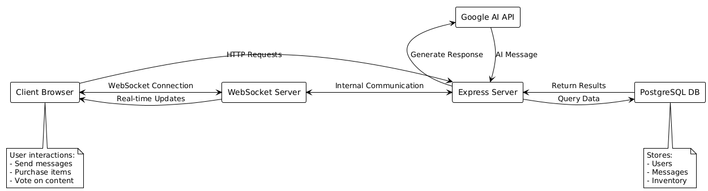
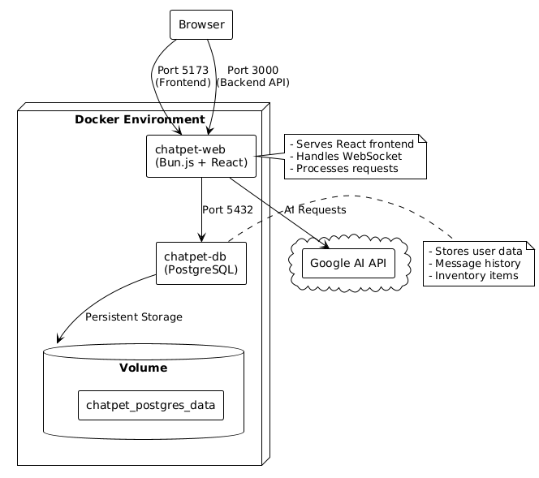
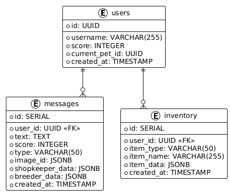
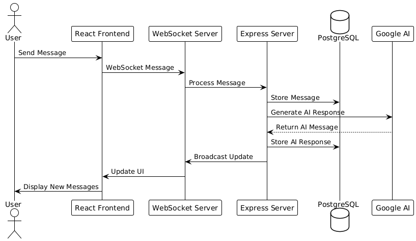

## Architecture

### Container Structure
1. Database Container (chatpet-db)
   - PostgreSQL database
   - Persistent volume storage
   - Port 5432

2. Web Application Container (chatpet-web)
   - Bun.js backend (Port 3000)
   - React frontend (Port 5173)
   - WebSocket support

### Data Flow
1. Client sends message via WebSocket
2. Server processes message
3. Message stored in PostgreSQL
4. Broadcast to other connected clients

## System Architecture Diagrams
Note: All Diagrams were made in planuml and pngs were added here due to github not supporting markdown / planuml integration

### Data Flow

### Container Architecture

### Database Schema

### Message Flow

